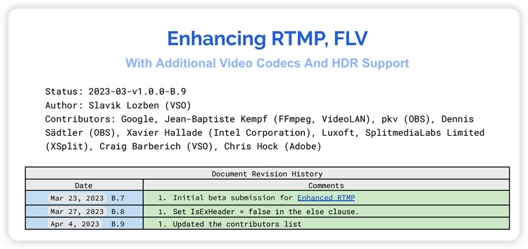
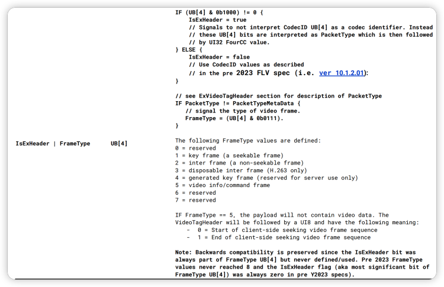

# enhanced RTMP/FLV

## ▦ 背景
众所周知，RTMP协议在直播场景下应用相当广泛，目前直播推流一般都是使用RTMP进行推流，但Adobe已经不再更新RTMP，故对于一些新的编码格式，标准的FLV格式不支持HEVC等编码，国内云厂商金山云定义了codecid=12作为HEVC的的codecid，国内一众的流媒体服务也是按照这个标准去实现，但对于ffmpeg、OBS等一些开源工具，这个国内标准并不支持。

## ▦ enhanced RTMP/FLV
近期Veovera Software Organization（VSO）提出了[enhanced RTMP](https://github.com/veovera/enhanced-rtmp)，旨在让RTMP/FLV支持目前比较流行的编码格式，例如HEVC、VP9、AV1。从文档来看，参与这个标准还有FFmpeg、VideoLAN(VLC)、OBS、Adobe等知名机构，说明这个新标准在不久的将来会广泛应用。

从最新的文档来看，目前enhanced RTMP/FLV只支持了HEVC、VP9、AV1等视频编码格式，相信在不久之后，音频编码格式也会支持上，相信到时候我们就不需要去魔改ffmpeg，接入门槛将会大大降低。不过，RTMP /FLV这个新标准，和国内通用的标准并不完全一样，但是新标准是兼容老的以及国内定义的标准的，要支持起来也很容易。

## ▦ 格式说明
RTMP内部负载也是使用FLV的Tag，故这里主要讲解下enhaned FLV Video Tag格式。

### ▦ 标准FLV Video Tag

在标准的FLV格式中，Video Tag由Tag Header和Tag Body组成，Tag Header固定5个字节，可以通过第一个字节的后4bits来判断codec信息。

### ▦ Enhaned FLV Video Tag

在Enhanced FLV标准中，Video Tag Header的5个字节，变成以上格式
（1）可以通过header[0]&0x80进行判断是否是enhanced FLV
（2）PacketType由原来标准的第2个字节变成了第一个字节后4bits，如果PacketType=0，表示是sequence header，后面的Tag Body便是CodecConfigurationRecord部分，例如HEVC就是HEVCDecoderConfigurationRecord。如果PacketType=1和PacketType=3，说明Tag Body就是NALus，不过PacketType=1需要注意的是，Tag Body的前3个字节为Composition Time。

## ▦ 目前支持Enhanced RTMP/FLV的服务器/客户端
OBS：OBS 29.1+
Srs:6.0.42+
mpegts：1.7.3+
lal:0.35.4+

## ▦ 如何测试
（1）打开OBS，在“输出”中在视频编码器中选择HEVC

（2）在“直播”中输入rtmp的地址，例如:rtmp://127.0.0.1:1936/live/test110

（3）使用ffplay或者VLC播放Rtsp或者HLS流
（4）如果想播放FLV流，由于ffmpeg和VLC暂时还不支持此标准，可以使用mpegts.js进行测试，笔者这里利用了srs的播放器，在URL中输入lal的http-flv的拉流地址即可
