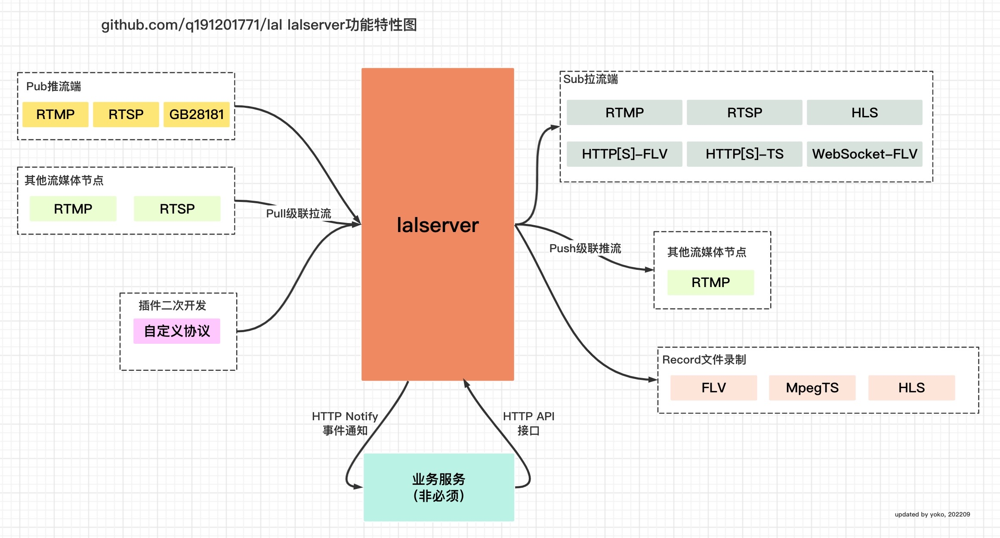

# This documentation page is out of date, please visit https://pengrl.com/lal

## Introduction to lalserver

lalserver is a streaming forwarding service. It is similar to the `nginx-rtmp-module` service.   Simply put, the core function of this kind of service is to forward the audio/video data sent by the push stream client to the corresponding pull stream client.
However, lalserver supports more protocols and provides richer functionality.

## 1 lalserver features

- [x] **All platforms**
  - [x] Supports Linux/macOS/Windows multi-system development, debugging, running.
  - [x] Supports running under multiple architectures. For example, amd64/arm64/arm32/ppc64le/mipsle/s390x.
  - [x] Supports cross-compilation. You can compile executables for other platforms on any platform.
  - [x] Runs without dependencies. The executable file does not have any environment or library installation dependencies, and can run independently with a single file.
  - [x] Provides executables for all platforms, which can be run directly without compilation (provided that all the source code is open).
  - [x] Supports docker both for the amd and arm architectures.
- [x] **High performance**. Multi-core and multi-threaded expansion, support for high concurrency, performance and the same type of `c/c++` development services at the same level.
- [x] **High availability**. Perfect unit test. And there are multiple online environment applications.
- [x] **Multiple live streaming encapsulation protocols**.
  - [x] Supports RTMP, RTSP(RTP/RTCP), HLS, HTTP[S]/WebSocket-FLV/TS, GB28181 (Chinese National Standard).
  - [x] Supports conversion between different encapsulation protocols.
  - [x] Supports secondary development through plug-ins, support for expansion for custom protocols for input and output.
- [x] **Multiple encoding formats**. Video support: H.264/AVC, H.265/HEVC, audio support: AAC, G711A/G711U.
- [x] **Multi-format recording**. Supports FLV, long MPEGTS, HLS recording (HLS live and recording can be turned on at the same time).
- [x] **HTTPS**. Supports HTTPS-FLV, HTTPS-TS, HLS over HTTPS pull streaming.
- [x] **WebSocket**. Supports WebSocket-FLV, WebSocket-TS pull streams.
- [x] **TLS/SSL**. All protocols support corresponding TLS/SSL encrypted transmission. For example, RTMPS, RTSPS, HTTPS, WebSockets.
- [x] **HLS**. Supports LIVE real-time broadcasting and VOD full list broadcasting. Sliced files support multiple deletion methods. Supports memory slicing. Supports counting the number of HLS players.
- [x] **RTSP**. Support over TCP (interleaved mode). Supports basic/digest auth authentication. Supports 461 error code..
- [x] **RTMP**. Supports adding muted audio data to a single video, and merge sending. Compatible with various common RTMP implementations. Supports enhanced RTMP.
- [x] **RTP**. Supports parsing extended headers.
- [x] **HTTP API Interface**. Used to get information about a service and send commands to the server.
- [x] **HTTP Notify event callback**. Get time notification, business side can easily customise its own logic.
- [x] **Supports multiple methods of authentication**.
- [x] **Support for distributed clustering**
- [x] **Static pull back to source**. Configure back to source via config file.
- [x] **Static push forward**. Supports push forward to multiple addresses. Configure push forward addresses via config file.
- [x] **Support on-demand sourceback**. Back to source pull streams without an audience can be actively turned off.
- [x] **CORS cross-domain**. HTTP-FLV, HTTP-TS, HLS cross-domain pull streams are supported. HTTP-API supports cross-domain.
- [x] **HTTP file server**. For example, HLS sliced files can be played directly without additional HTTP file servers.
- [x] **Listening port multiplexing**. HTTP-FLV, HTTP-TS, HLS can use the same ports. The same applies to HTTPS.
- [x] **Second on playback**. GOP buffering.
- [x] **Supports (on server-side) automatic overlay of muted audio**.
- [x] **Supports pulling streams before pushing streams**.
- [x] **Supports reconnect after push stream disconnect, no gap perception on pull stream side**.
- [x] **Supports custom debug format stream recording, stream playback, quickly reproduce and locate the problem**.
- [x] **Bring your own Web UI page**.
- [x] **Supports video with B-frames**.

## 2 Protocols supported by lalserver

| Trans encapsulation type | sub rtmp | sub http[s]/websocket[s]-flv | sub http[s]/websocket[s]-ts | sub hls | sub rtsp | relay push rtmp |
|--------------------------|----------|------------------------------|-----------------------------|---------|----------|-----------------|
| pub rtmp                 |    ✔     |             ✔                |              ✔              |    ✔    |    ✔     |       ✔         |
| pub rtsp                 |    ✔     |             ✔                |              ✔              |    ✔    |    ✔     |       ✔         |
| relay pull rtmp          |    ✔     |             ✔                |              ✔              |    ✔    |    ✔     |       ✔         |

### Support for encoding protocols by encapsulation protocol

| Encoding type | rtmp | rtsp | hls | flv | mpegts |
|---------------|------|------|-----|-----|--------|
| aac           |   ✔  |   ✔  |  ✔  |  ✔  |   ✔    |
| avc/h264      |   ✔  |   ✔  |  ✔  |  ✔  |   ✔    |
| hevc/h265     |   ✔  |   ✔  |  ✔  |  ✔  |   ✔    |

### Recorded file type

| Type of recording | hls | flv | mpegts |
|-------------------|-----|-----|--------|
| pub rtmp          |  ✔  |  ✔  |    ✔   |
| pub rtsp          |  ✔  |  ✔  |    ✔   |

For the meaning of this table, see: [connection type session pub/sub/push/pull](Session.md).

Note that if only RTSP streams (RTP packets to be exact) are forwarded to each other, and no transcapsulation into other formats is involved, all types are theoretically supported.

## 3 lalserver feature map

updated by yoko, 211211
